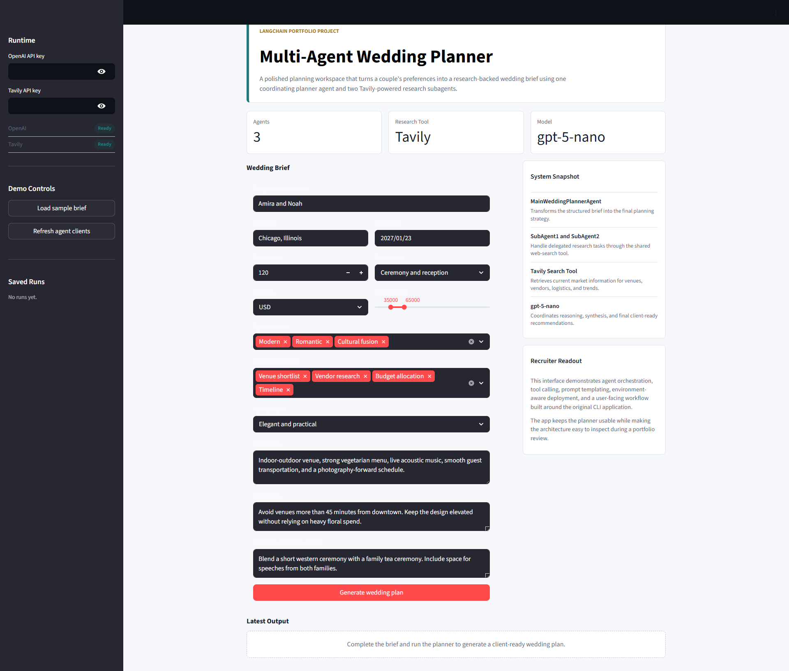

# Multi-Agent Wedding Planner with LangChain

> A Streamlit and CLI wedding-planning assistant that turns a couple's preferences into a research-backed wedding plan using LangChain agents, Groq, and Tavily web search.

[](https://www.python.org/)
[](https://www.langchain.com/)
[](https://streamlit.io/)
[](https://groq.com/)
[](https://www.tavily.com/)
[](https://docs.astral.sh/uv/)

---

## What Is This?

This project is a portfolio-ready **multi-agent wedding planning system**. The user provides a structured wedding brief: location, date, guest count, budget, style direction, priorities, constraints, and cultural details. A main planner agent then coordinates the work, delegates live research tasks to two search-enabled subagents, and synthesizes a client-ready planning strategy.

The project includes two ways to run the planner:

- **Streamlit app**: a polished browser workflow with API-key status, sample brief loading, structured inputs, generated output tabs, saved runs, and a Markdown download button.
- **CLI app**: a terminal entry point that accepts free-form wedding requirements and prints the generated plan.

| File | Responsibility |
|---|---|
| `app.py` | Streamlit interface, form workflow, API-key handling, saved runs, and result rendering |
| `main.py` | CLI workflow for entering wedding requirements and invoking the main agent |
| `agents.py` | LangChain subagent setup and delegation tools used by the main planner |
| `tools.py` | Tavily web-search tool exposed to the research subagents |
| `models.py` | Groq chat model initialization through LangChain |
| `prompts.py` | Planner system prompt and main user prompt templates |
| `pyproject.toml` | Python version and dependency definitions for `uv` |

---

## Screenshots

### Streamlit Planning Workspace



The main interface collects the wedding brief, shows runtime readiness for Groq and Tavily, exposes demo controls, and summarizes the active architecture.

---

### CLI Agent Run


The command-line workflow logs subagent initialization, main-agent execution, Groq requests, and Tavily-backed research queries.

---

### CLI Generated Plan


The CLI output returns a practical planning response with budget allocation, venue concepts, vendor suggestions, and tradeoffs.

---

### Live Streamlit Execution


During generation, the app reports progress while preparing the planner prompt, loading dependencies, delegating research, and synthesizing the plan.

---

### Generated Plan


The final plan is rendered inline with metrics for runtime, brief length, and saved runs.

---

### Input Brief and Architecture Tabs


The app keeps the exact structured prompt visible for review and includes an architecture tab showing how the UI, planner agent, delegation tools, subagents, and Tavily search connect.

---

## Feature List

### Multi-Agent Planning

- Main wedding planner agent synthesizes the final recommendation.
- Two research subagents can be called as tools by the main agent.
- Each subagent has access to Tavily web search for current venue, vendor, logistics, and market information.
- The final response is shaped around an executive summary, recommendations, budget allocation, timeline, risks, tradeoffs, and open questions.

### Streamlit UI

- Structured wedding brief form with defaults for fast demos.
- Sidebar runtime panel for `GROQ_API_KEY` and `TAVILY_API_KEY`.
- API keys can be loaded from `.env`, Streamlit secrets, or entered directly in the sidebar.
- Sample brief loader for portfolio demonstrations.
- Agent-client refresh button for reloading cached dependencies.
- Saved-run history stored in Streamlit session state.
- Output tabs for the final plan, exact input brief, and architecture diagram.
- Markdown download button for generated plans.

### CLI Workflow

- `main.py` accepts free-form wedding requirements from the terminal.
- Logs agent initialization, delegation, web-search activity, and API calls.
- Useful for debugging the agent workflow without the Streamlit layer.

### Configuration

- Python dependencies are managed with `uv`.
- Environment variables are loaded from `.env` through the `dotenv` package.
- The model is initialized in one place through LangChain's `init_chat_model`.
- The active default model is `llama-3.3-70b-versatile`.

---

## How It Works

1. **The user provides a wedding brief.** In Streamlit, this happens through structured form fields. In the CLI, the user enters free-form requirements.

2. **The brief is injected into the planner prompt.** `WEDDING_PLANNER_AGENT_PROMPT` receives the user requirements and defines the main agent's role as an expert wedding planner.

3. **The main planner agent is created.** LangChain's `create_agent` wires the Groq model to two delegation tools: `delegate_to_subagent1` and `delegate_to_subagent2`.

4. **Subagents perform research.** Each delegation tool invokes a separate LangChain subagent. The subagents use the shared Tavily `search_web` tool to gather current information.

5. **The main agent synthesizes the final plan.** The planner combines the original brief and subagent research into a practical wedding strategy.

6. **The result is displayed or printed.** Streamlit renders the answer in tabs and offers a download button; the CLI prints the response directly to the terminal.

---

## Architecture

```text
Streamlit UI / CLI
    -> user wedding requirements
    -> WEDDING_PLANNER_AGENT_PROMPT
    -> MainWeddingPlannerAgent
        -> delegate_to_subagent1(query)
            -> SubAgent1
                -> Tavily search_web(topic)
        -> delegate_to_subagent2(query)
            -> SubAgent2
                -> Tavily search_web(topic)
    -> synthesized wedding plan
```

The design keeps responsibilities small: `models.py` owns model setup, `tools.py` owns external search, `agents.py` owns subagent delegation, and `app.py` owns the user experience.

---

## Project Structure

```text
MultiAgent_Wedding_Planner/
|
+-- app.py                 # Streamlit application
+-- main.py                # CLI entry point
+-- agents.py              # Subagents and delegation tools
+-- tools.py               # Tavily search tool
+-- models.py              # Groq model initialization
+-- prompts.py             # Prompt templates
+-- pyproject.toml         # Project metadata and dependencies
+-- uv.lock                # Locked dependency graph
+-- README.md              # Project documentation
+-- .env                   # Local API keys, not committed
+-- .gitignore
`-- screenshots/           # App and CLI screenshots
```

---

## Getting Started

### Prerequisites

| Requirement | Notes |
|---|---|
| Python 3.12+ | Required by `pyproject.toml` |
| `uv` | Used for dependency installation and command execution |
| Groq API key | Required for the planner model |
| Tavily API key | Required for web-search research |

Check your local versions:

```bash
python --version
uv --version
```

If `uv` is not installed:

```bash
pip install uv
```

### 1. Clone the repository

```bash
git clone https://github.com/Shivakulakarni/MultiAgent_Wedding_Planner.git
cd MultiAgent_Wedding_Planner
```

### 2. Install dependencies

```bash
uv sync
```

This creates the virtual environment and installs the locked dependencies from `uv.lock`.

### 3. Configure environment variables

Create a `.env` file in the project root:

```env
GROQ_API_KEY=your_groq_api_key_here
TAVILY_API_KEY=your_tavily_api_key_here
```

The `.env` file is included in `.gitignore`, so your local keys should not be committed.

### 4. Run the Streamlit app

```bash
uv run streamlit run app.py
```

Then open the local Streamlit URL shown in your terminal, usually:

```text
http://localhost:8501
```

### 5. Run the CLI version

```bash
uv run python main.py
```

Enter your wedding requirements when prompted. The agent logs its research workflow and prints the final plan in the terminal.

---

## Usage

1. Add `GROQ_API_KEY` and `TAVILY_API_KEY` in `.env`, Streamlit secrets, or the sidebar.
2. Launch the app with `uv run streamlit run app.py`.
3. Click **Load sample brief** for a quick demo, or fill in your own wedding details.
4. Choose the location, target date, guest count, currency, budget, event scope, style direction, planning priorities, and planner tone.
5. Add must-haves, constraints, and cultural or family details.
6. Click **Generate wedding plan**.
7. Review the generated plan, inspect the input brief, view the architecture tab, and download the result as Markdown.

---

## Environment Variables

| Variable | Required | Purpose |
|---|---:|---|
| `GROQ_API_KEY` | Yes | Authenticates LangChain's Groq chat model |
| `TAVILY_API_KEY` | Yes | Authenticates Tavily web search |

The Streamlit app can read these values from:

- A local `.env` file.
- Streamlit secrets.
- The sidebar password inputs.

---

## Key Design Decisions

| Choice | Reason |
|---|---|
| Multi-agent delegation | Separates planning synthesis from research tasks and demonstrates LangChain tool calling |
| Tavily search | Gives the planner access to current web information for venue, vendor, budget, and logistics research |
| Streamlit front end | Makes the agent workflow easy to demo in a browser without hiding the underlying architecture |
| CLI entry point | Keeps a lightweight debugging path for testing prompts and agent behavior |
| Session-state saved runs | Lets users compare recent outputs without adding a database |
| Single model initialization module | Keeps model selection and environment loading centralized |

---

## Tech Stack

| Layer | Tool | Role |
|---|---|---|
| Language | Python 3.12+ | Application runtime |
| Agent framework | LangChain | Agent creation, tool calling, and message orchestration |
| LLM provider | Groq | Main reasoning and response synthesis model |
| Web research | Tavily | Search API used by subagents |
| UI | Streamlit | Browser-based planning workspace |
| Environment config | dotenv | Loads API keys from `.env` |
| Package management | uv | Dependency resolution, virtual environment, and command execution |

---

## Limitations

- The project requires valid Groq and Tavily API keys.
- Web-search quality depends on Tavily results and the specificity of delegated queries.
- Generated plans should be reviewed by a human planner before being used for real bookings, contracts, or budget commitments.
- Saved runs live only in Streamlit session state; they disappear when the session restarts.
- The current implementation uses two similar research subagents. More specialized subagents could improve separation of responsibilities.

---

## Future Improvements

- Add specialized subagents for venues, vendors, budgets, timelines, and travel logistics.
- Persist generated plans to local files or a database.
- Add structured JSON output alongside the Markdown plan.
- Add automated tests for prompt construction, delegation tools, and Streamlit helper functions.
- Add source citations from Tavily results into the final wedding plan.
- Add configurable model selection in the UI.
- Export plans as PDF or DOCX for client delivery.

---

## Security Notes

- Never commit `.env` or real API keys.
- Rotate keys immediately if they are accidentally pushed to a public repository.
- Review generated recommendations before contacting vendors or making payments.

---

## License

MIT. Use it, extend it, and build on it.
